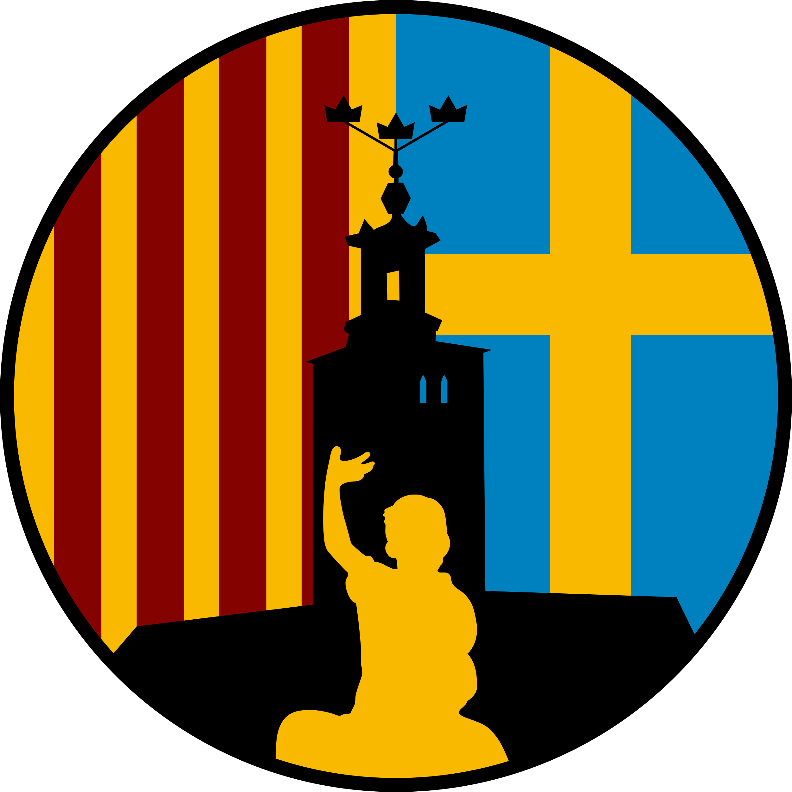
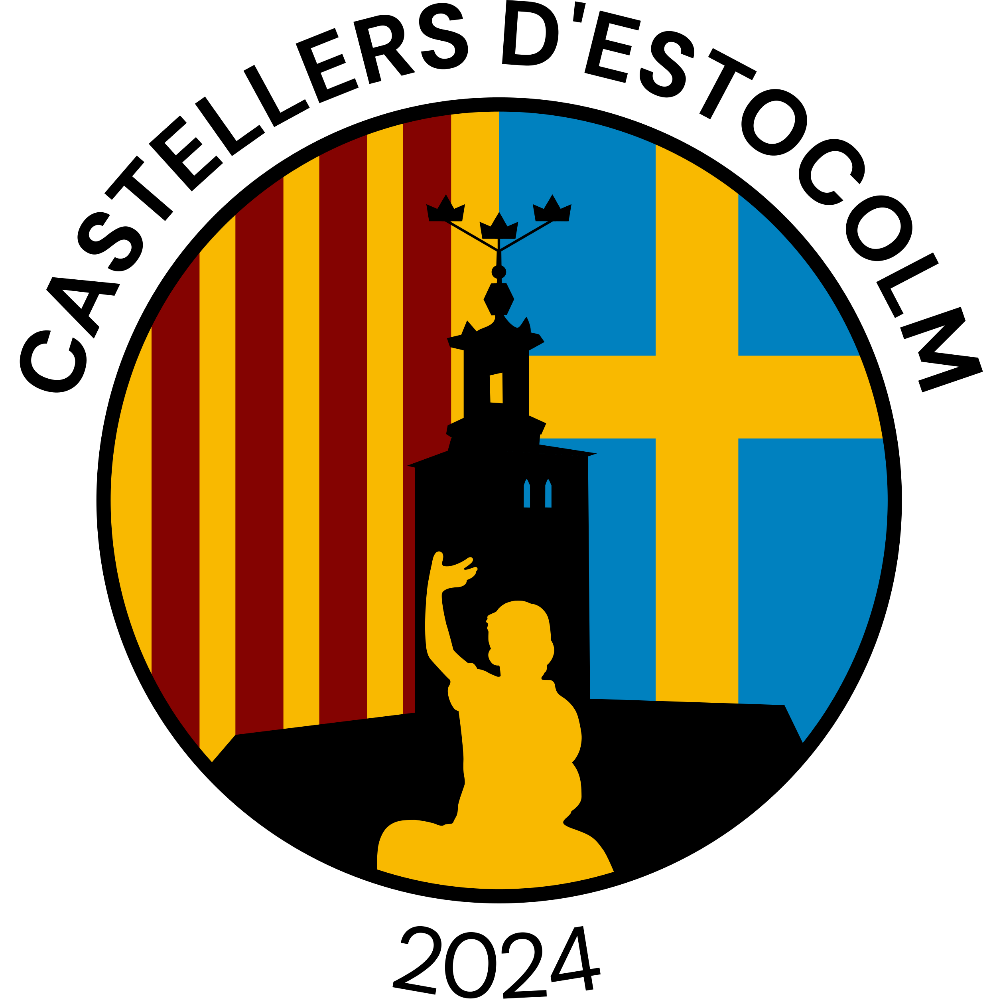
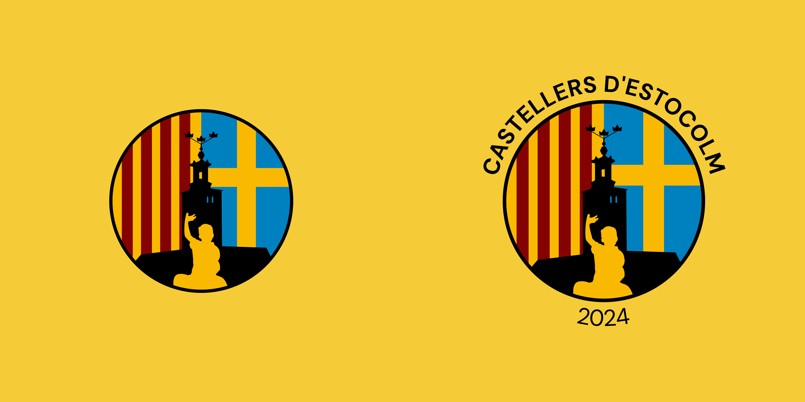

# Escut

L'escut està composat per la senyera catalana i la bandera de Suècia de fons a l'esquerra i dreta respectivament ocupant parts iguals. Al mig hi ha representat l'ajuntament d'Estocolm en color negre i just davant a la part inferior una enxaneta alçant el braç de color groc igual que el de les dues banderes.



<figure><figcaption>
Escut en color
</figcaption></figure>



<figure><figcaption>
Escut en blanc i negre
</figcaption></figure>



<figure><figcaption>
Escut amb nom en color
</figcaption></figure>



En concret, els colors de l'escut són els següents.

<table><thead><tr><th width="176">Groc</th><th>Vermell</th><th>Blau</th><th>Samarreta</th></tr></thead><tbody><tr><td>#f9b900</td><td>#840301</td><td>#0081bf</td><td>#f6cb38</td></tr></tbody></table>

<figure><figcaption>
Escut amb el fons de la samarreta
</figcaption></figure>
